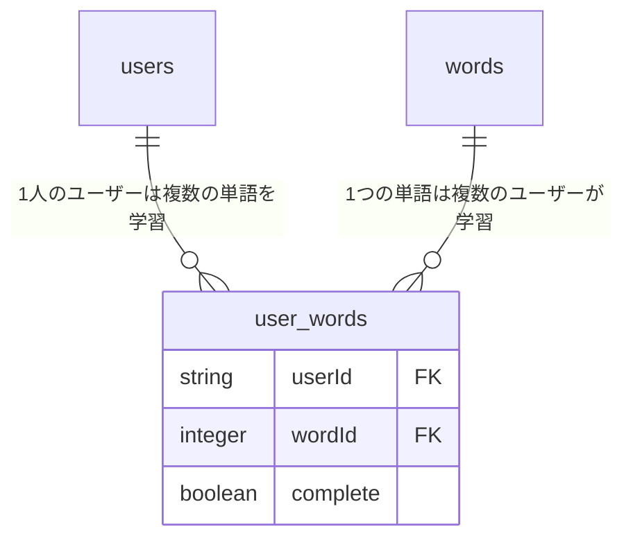

# SpreadWord プロジェクト

## データベース構造の説明

### テーブル構造

1. `users` テーブル
   - ユーザー情報を管理
   - 認証情報やプロフィール情報を保存

2. `words` テーブル
   - 学習する単語のデータを管理
   - 単語、意味、品詞などの基本情報を保存

3. `user_words` テーブル（中間テーブル）
   - ユーザーと単語の関係を管理
   - 各ユーザーの単語学習の進捗状況を追跡
   - `complete` フラグでユーザーごとの単語の完了状態を管理

### リレーションの説明



### 特徴
- 多対多（Many-to-Many）の関係
  - 1人のユーザーが複数の単語を学習できる
  - 1つの単語を複数のユーザーが学習できる
- ユーザーごとの進捗管理
  - 同じ単語でも、ユーザーによって進捗状況（complete）が異なる
  - 例：ユーザーAは"cat"を完了、ユーザーBは"cat"を未完了

## 技術スタック

- データベース: SQLite
- ORM: Drizzle
- フレームワーク: Next.js

## 主な機能

### 1. ダッシュボード機能 ✅
- ユーザーの学習進捗の可視化
- 完了した単語数と総単語数の表示
- 最近学習した単語のリスト
- 学習統計情報の表示
- 日付別の間違えた単語の詳細表示
- Geminiを活用した例文生成機能

### 2. 4択クイズ機能 ✅
- ランダムな単語から4択問題を生成
- 正解・不正解の即時フィードバック
- 学習履歴の記録
- 苦手な単語の優先出題

### 3. 単語学習機能
- 単語リストの表示
- 単語の完了状態の管理
- 進捗状況の追跡
- フラッシュカードモードでの学習

## 実装状況

SpreadWord実装計画IIの主要機能が完了し、現在は以下の機能が利用可能です：

### 完了した主要機能 ✅
- データベース基盤
  - 基本的なデータベース構造の確立
  - user_words中間テーブルの実装
  - リレーション構造の最適化

- クイズ機能
  - 4択クイズの実装
  - ランダム単語選択システム
  - 即時フィードバック機能
  
- ダッシュボード機能
  - 学習進捗の可視化
  - 学習統計情報の表示
  - 日付別の間違えた単語の詳細表示
  - Geminiを活用した例文生成機能の統合
  
- フラッシュカード機能
  - 基本的なフラッシュカードモード
  - 単語、意味、例文の表示
  - ユーザーノート機能
  - 進捗管理システム

### 今後の開発予定 🚀
- スペルチェックモード
- 音声発音練習モード
- レベル別学習コース
- 詳細な学習分析機能
- ソーシャル機能とゲーミフィケーション


```env
TURSO_LOCAL_DATABASE_URL=http://127.0.0.1:8080
rm -rf src/db/migrations/*
docker compose down -v && docker compose up -d db && bun run db:generate && bun run db:migrate

```